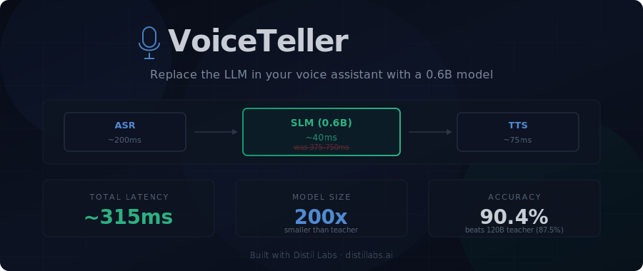

# VoiceTeller 🎙️: **Replace the LLM in your voice assistant with a 0.6B model**

*A fine-tuned small language model that handles banking intent routing at ~40ms, cutting voice pipeline latency from ~850ms to ~315ms.*

<p align="center">
  
</p>

You're building a voice assistant. You wire up a cloud LLM for the "brain" stage, and it works. But the 375-750ms inference latency makes every conversation feel sluggish. Users notice. For banking workflows with defined intents and bounded slot types, you don't need a general-purpose 100B+ model. You need a fast, accurate specialist.

We fine-tuned a **Qwen3-0.6B** model to handle multi-turn tool calling for banking customer service. It classifies intents and extracts slots as structured function calls, running at **~40ms** vs 375-750ms for cloud LLMs. Combined with local ASR and TTS, the full voice pipeline runs under 400ms, well within the 500-800ms threshold for natural conversation. The model runs locally, requires no API keys, and keeps all customer data private.

[Distil Labs](https://www.distillabs.ai/?utm_source=github&utm_medium=referral&utm_campaign=voice-assistant) is a platform for training task-specific small language models. We use knowledge distillation to compress what large models know into tiny, specialized models. The result: models 50-400x smaller than current state-of-the-art LLMs that maintain comparable accuracy and run entirely on your machine. Check out [our docs](https://docs.distillabs.ai/) if you want to dive deeper.


## Results

### Latency

Enterprise voice assistants follow a cascaded pipeline: ASR (speech-to-text) -> LLM (intent & reasoning) -> TTS (text-to-speech). The LLM stage is consistently the bottleneck, consuming over 70% of processing time.

| Component | Cloud LLM Pipeline | SLM Pipeline |
|---|---|---|
| ASR (Speech-to-Text) | 200-350ms | ~200ms |
| **LLM / SLM** | **375-750ms** | **~40ms** |
| TTS (Text-to-Speech) | 75-150ms | ~75ms |
| **Total** | **680-1300ms** | **~315ms** |

### Accuracy

| Model | Parameters | Single-Turn Tool Call Accuracy | Model Link |
|---|---|---|---|
| GPT-oss-120B (teacher) | 120B | 87.5% | |
| **Qwen3-0.6B (tuned)** | **0.6B** | **90.9%** | [HuggingFace](https://huggingface.co/distil-labs/distil-qwen3-0.6b-voice-assistant-banking) |
| Qwen3-0.6B (base) | 0.6B | 48.7% | |

The tuned 0.6B model **exceeds the 120B teacher** on single-turn tool call accuracy while being **200x smaller** and running locally. The base Qwen3-0.6B only achieves 48.7% per turn. Fine-tuning is essential.


## Quick Start

### Prerequisites

- Python 3.12+
- [Homebrew](https://brew.sh/) (macOS)
- [llama.cpp](https://github.com/ggerganov/llama.cpp) with `llama-server` on your PATH

### 1. Download the models

Download the three models and place them in the `models/` directory:

| Model | Purpose | Download |
|---|---|---|
| Qwen3-ASR-0.6B | Speech-to-text | [HuggingFace](https://huggingface.co/Qwen/Qwen3-ASR-0.6B) |
| Qwen3-TTS-12Hz-0.6B-Base | Text-to-speech | [HuggingFace](https://huggingface.co/Qwen/Qwen3-TTS-12Hz-0.6B-Base) |
| distil-qwen3-0.6b-voice-assistant-banking (GGUF) | Intent & slot extraction | [HuggingFace](https://huggingface.co/distil-labs/distil-qwen3-0.6b-voice-assistant-banking) |

```bash
# ASR
huggingface-cli download Qwen/Qwen3-ASR-0.6B --local-dir models/Qwen3-ASR-0.6B

# TTS
huggingface-cli download Qwen/Qwen3-TTS-12Hz-0.6B-Base --local-dir models/Qwen3-TTS-12Hz-0.6B-Base

# SLM (fine-tuned intent router)
huggingface-cli download distil-labs/distil-qwen3-0.6b-voice-assistant-banking --local-dir models/Qwen3-voice-assistant-slm-0.6B-gguf
```

The `assets/` directory ships with the repo and includes the default TTS reference voice clip.

### 2. Install dependencies

```bash
./install.sh
```

This installs all Python packages and the SoX system binary. The `qwen-asr` and `qwen-tts` packages have conflicting `transformers` pins (`==4.57.6` vs `==4.57.3`), so they are installed with `--no-deps`.

### 3. Start the SLM server

```bash
llama-server \
    --model models/Qwen3-voice-assistant-slm-0.6B-gguf/Qwen3-voice-assistant-slm-0.6B.gguf \
    --port 8000
```

### 4. Run the assistant

**Text-only mode** (no mic/speaker needed):

```bash
python orchestrator.py --port 8000
```

**Full voice mode** (push-to-talk):

```bash
python voice_assistant.py --slm-port 8000 --device auto
```

For voice use, make sure to use `--device mps` on Apple Silicon (recommended) or `--device cuda:0` on NVIDIA GPUs. TTS is too slow on CPU.


## Usage Examples

The assistant handles banking requests through voice (push-to-talk) or text. It identifies the intent, asks for any missing information, and executes the action.

### Multi-turn slot filling

```
You: I want to transfer some money
Bot: Could you provide the amount, which account to transfer from, and which account to transfer to?
You: 200 dollars from checking to savings
Bot: Done. Transferred $200.00 from checking to savings.
```

### Complete information in one turn

```
You: Cancel my credit card ending in 4532
Bot: Done. Your credit card ending in 4532 has been cancelled.
```

### Intent unclear then clarified

```
You: What about that thing I did the other day?
Bot: I didn't quite understand that. Could you tell me what you need? I can help you check
     your balance, transfer money, cancel or replace cards, pay bills, report fraud,
     or connect you to an agent.
You: ok lets cancel my card
Bot: Could you provide credit or debit, and the last 4 digits?
You: debit
Bot: Could you provide the last 4 digits?
You: 1234
Bot: Done. Your debit card ending in 1234 has been cancelled.
```

### Mid-conversation intent change

```
You: I need to cancel my card
Bot: Could you provide credit or debit, and the last 4 digits?
You: Actually, what's my checking balance first?
Bot: Your checking balance is $2,847.32.
```


## How We Trained VoiceTeller

### The Problem

Voice assistants handling defined workflows don't need open-ended generation. They perform a narrow set of tasks: intent classification, slot extraction, and dialogue state tracking. These are classification and extraction tasks, and they are exactly the kind of narrow, well-defined tasks where small language models can shine, if properly trained.

And accuracy compounds across turns. In multi-turn conversations, the probability of getting every turn right is roughly the single-turn accuracy raised to the number of turns. A model with 90% single-turn accuracy drops to about 73% over a 3-turn conversation (0.9^3). At 48.7% single-turn accuracy, which is where the base Qwen3-0.6B lands, a 3-turn conversation succeeds only about 11.6% of the time (0.487^3). Every percentage point of single-turn accuracy matters enormously once you compound it across a real conversation.

Key requirements:

* **Fast:** under 50ms inference to keep the full voice pipeline under 400ms
* **Accurate:** match or exceed cloud LLM accuracy on multi-turn tool calling
* **Runs locally:** no API calls, works offline, keeps customer data private
* **Handles real speech:** robust to ASR transcription artifacts (filler words, homophones, word splits)

### Validating the Base Model Fails

Before investing in training, we needed to confirm that off-the-shelf small models can't already do this. We tested Qwen3-0.6B on our test set of 48 banking conversations.

The base model achieved **48.7% single-turn tool call accuracy**, worse than a coin flip for most intents, and roughly 11.6% over a 3-turn conversation. Common failure modes:

* **Free-text responses instead of JSON:** the model generates conversational replies like "I can help you with that!" instead of structured function calls
* **Hallucinated function names:** the model invents functions not in the catalog, like `get_account_info` or `help_user`
* **Missed slots across turns:** when a user provides information over multiple turns, the base model fails to carry forward previously extracted slots
* **Malformed JSON:** incomplete or unparseable output that breaks the orchestrator

This confirmed the task is learnable but not already learned. A perfect candidate for fine-tuning.

### Establishing a Teacher Baseline

We tested GPT-oss-120B with a system prompt explaining the task, function catalog, and output format. The 120B model achieved **87.5% accuracy**. This became our target to match or exceed.

The teacher's main failure modes were edge cases around ambiguous intents and complex multi-turn context carryover, not systematic errors. This meant the task was solvable and the failures were addressable through targeted training data.

### Defining the Tool Schema

The model handles 14 banking operations. Given a user utterance and conversation history, it outputs a structured tool call:

```
User: "I need to cancel my credit card ending in 1234"

SLM Output:
{"name": "cancel_card", "arguments": {"card_type": "credit", "card_last_four": "1234"}}
```

When information is missing, the model still identifies the intent and fills in what it can:

```
User: "I want to transfer some money"

SLM Output:
{"name": "transfer_money", "arguments": {"amount": null, "from_account": null, "to_account": null}}
```

The full function catalog:

| Function | Required Slots | Description |
|---|---|---|
| `check_balance` | `account_type` | Check account balance |
| `transfer_money` | `amount`, `from_account`, `to_account` | Transfer between accounts |
| `pay_bill` | `payee`, `amount` | Pay a bill |
| `cancel_card` | `card_type`, `card_last_four` | Cancel a card |
| `replace_card` | `card_type`, `card_last_four` | Request replacement card |
| `activate_card` | `card_last_four` | Activate a new card |
| `reset_pin` | `card_type`, `card_last_four` | Reset card PIN |
| `report_fraud` | `card_type` | Report fraudulent transaction |
| `get_statement` | `account_type` | Request account statement |
| `speak_to_human` | — | Connect to a human agent |
| `greeting` | — | Conversation start |
| `goodbye` | — | Conversation end |
| `thank_you` | — | Express gratitude |
| `intent_unclear` | — | Cannot determine intent |

### Creating Seed Data

We wrote **77 training conversations** covering all 14 banking functions, including multi-turn slot filling, intent changes, and error recovery flows.

A key design decision: because this model sits behind an ASR module, we included **ASR transcription artifacts** in the training data. Real speech-to-text output contains filler words, homophones, and word boundary errors that clean text datasets miss entirely:

```
Clean:    "Transfer 500 from my savings to checking"
With ASR: "Trans fur 500 from my savin to checkin"
With ASR: "Um I need to like transfer um five hundred dollars"
```

This makes the model robust to the kind of input it actually receives in production, rather than the idealized text that benchmarks test on.

### Synthetic Expansion and Fine-Tuning

Using the [Distil Labs data synthesis pipeline](https://www.distillabs.ai/blog/small-expert-agents-from-10-examples/?utm_source=github&utm_medium=referral&utm_campaign=voice-assistant), we expanded the 77 seed conversations into thousands of training examples with diverse phrasings, error patterns, and conversational flows.

We trained Qwen3-0.6B using the Distil CLI on a multi-turn tool calling task, with GPT-oss-120B as the teacher model for knowledge distillation.

```bash
curl -fsSL https://cli-assets.distillabs.ai/install.sh | sh
distil login

distil model create banking-voice-assistant
distil model upload-data <model-id> --data ./slm-finetuning/data
distil model run-training <model-id>
distil model download <model-id>
```

See [`slm-finetuning/`](slm-finetuning/) for the full training data and configuration.

### Results

| Model | Parameters | Single-Turn Tool Call Accuracy | Size Reduction |
|---|---|---|---|
| GPT-oss-120B (teacher) | 120B | 87.5% | — |
| **Qwen3-0.6B (tuned)** | **0.6B** | **90.9%** | **200x** |
| Qwen3-0.6B (base) | 0.6B | 48.7% | — |

The tuned student **exceeds the 120B teacher by nearly 3 points** on single-turn accuracy while being 200x smaller. The base model is essentially unusable at 48.7% per turn, which compounds to about 11.6% over a typical 3-turn banking conversation. The synthetic data generation and fine-tuning pipeline is what closes the gap, turning a model that can't follow the tool schema into one that outperforms a 120B general-purpose LLM on this specific task.

You might be asking how a 0.6B model can outperform a 120B teacher. Two reasons: first, the data validators in our pipeline filter out the teacher's mistakes, so the student trains only on high-quality examples. Second, the student specializes entirely on this one task, allocating all its capacity to banking intent routing rather than spreading it across general capabilities. More details on this in our [benchmarking post](https://www.distillabs.ai/blog/benchmarking-the-platform/?utm_source=github&utm_medium=referral&utm_campaign=voice-assistant).

### Qualitative Examples: Base vs. Tuned

#### Example 1: Basic intent with ASR noise
**Input:** `"um I need to like cancel my uh debit card"`

| Model | Prediction |
|---|---|
| Reference | `{"name": "cancel_card", "arguments": {"card_type": "debit", "card_last_four": null}}` |
| Base Qwen3-0.6B | `I'd be happy to help you cancel your debit card. Could you please provide me with...` (free text, not JSON) |
| **Tuned Qwen3-0.6B** | `{"name": "cancel_card", "arguments": {"card_type": "debit", "card_last_four": null}}` |

**Analysis:** The base model responds conversationally instead of producing a structured function call. The tuned model correctly identifies the intent and extracts the card type, even through filler words.

#### Example 2: Multi-turn slot carryover
**Turn 1 input:** `"I want to transfer money from checking"`
**Turn 2 input:** `"200 to savings"`

| Model | Turn 2 Prediction |
|---|---|
| Reference | `{"name": "transfer_money", "arguments": {"amount": 200, "from_account": "checking", "to_account": "savings"}}` |
| Base Qwen3-0.6B | `{"name": "transfer_money", "arguments": {"amount": 200, "from_account": null, "to_account": "savings"}}` (lost `from_account` from turn 1) |
| **Tuned Qwen3-0.6B** | `{"name": "transfer_money", "arguments": {"amount": 200, "from_account": "checking", "to_account": "savings"}}` |

**Analysis:** The base model fails to carry forward `from_account` from the previous turn. The tuned model correctly merges information across the conversation.

#### Example 3: Mid-conversation intent change
**Turn 1 input:** `"I need to cancel my card"`
**Turn 2 input:** `"Actually, what's my checking balance?"`

| Model | Turn 2 Prediction |
|---|---|
| Reference | `{"name": "check_balance", "arguments": {"account_type": "checking"}}` |
| Base Qwen3-0.6B | `{"name": "cancel_card", "arguments": {"card_type": "checking", ...}}` (stuck on previous intent, maps "checking" to wrong function) |
| **Tuned Qwen3-0.6B** | `{"name": "check_balance", "arguments": {"account_type": "checking"}}` |

**Analysis:** The base model gets stuck on the `cancel_card` intent from the previous turn and incorrectly maps "checking" as a card type. The tuned model correctly recognizes the intent change.


## How the Orchestrator Works

The SLM never generates user-facing text. All responses come from deterministic templates, ensuring predictable latency and brand consistency. The orchestrator checks for missing required slots, generates clarification questions or success responses, and maintains conversation state.

```
┌───────────────┐    ┌───────────────┐    ┌───────────────┐
│   Qwen3-ASR   │    │  Qwen3-0.6B   │    │   Qwen3-TTS   │
│               │───>│  (fine-tuned)  │───>│               │
│  ~200ms       │    │  ~40ms         │    │  ~75ms        │
└───────────────┘    └───────────────┘    └───────────────┘
       ▲                    │                    ▼
┌──────┴──────┐    ┌───────────────┐    ┌──────┴──────┐
│  Microphone │    │ ORCHESTRATOR  │    │   Speaker   │
└─────────────┘    │ - Slot check  │    └─────────────┘
                   │ - Templates   │
                   │ - State mgmt  │
                   └───────────────┘
```

This separation matters: the SLM handles the hard part (understanding what the user wants), while the orchestrator handles the predictable part (deciding what to say back). The result is a system where latency is bounded and responses are always well-formed.


## ASR Module

The ASR module (`asr.py`) converts speech to text using [Qwen3-ASR-0.6B](https://huggingface.co/Qwen/Qwen3-ASR-0.6B). It defines a `Protocol`-based interface, so **you can swap in any ASR backend**: a different local model (Whisper, Moonshine), a cloud API (Google Speech-to-Text, Deepgram, AssemblyAI), or a custom implementation. Any class with a matching `transcribe(audio, sample_rate) -> str` signature works as a drop-in replacement.

```python
class ASRModule(Protocol):
    def transcribe(self, audio: np.ndarray, sample_rate: int) -> str: ...

# Use any backend:
asr = Qwen3ASR(model_path="models/Qwen3-ASR-0.6B", device="mps")       # local
asr = WhisperASR(model="large-v3")                                       # local alternative
asr = DeepgramASR(api_key="...")                                          # cloud
```


## TTS Module

The TTS module (`tts.py`) converts text to speech using [Qwen3-TTS-12Hz-0.6B-Base](https://huggingface.co/Qwen/Qwen3-TTS-12Hz-0.6B-Base) with voice cloning. It uses the same `Protocol`-based interface as ASR, so **you can swap in any TTS backend**: a different local model (Piper, Bark), a cloud API (ElevenLabs, Google TTS, Amazon Polly), or a custom implementation.

```python
class TTSModule(Protocol):
    def synthesize(self, text: str) -> tuple[np.ndarray, int]: ...

# Use any backend:
tts = Qwen3TTS(model_path="models/Qwen3-TTS-12Hz-0.6B-Base", device="mps")  # local
tts = ElevenLabsTTS(api_key="...", voice_id="...")                             # cloud
```

The default reference voice for cloning is provided at `assets/default_voice.wav`. To use a custom voice:

```bash
python voice_assistant.py \
    --ref-audio path/to/your_voice.wav \
    --ref-text "Exact transcript of the reference audio." \
    --slm-port 8000 --device mps
```


## Train Your Own Model

The workflow we used for VoiceTeller is generic across multi-turn tool calling tasks. You can train a model for your own voice assistant:

### 1. Define your functions

Specify the intent functions and their argument schemas. Be specific about argument types and allowed values. See `slm-finetuning/data/job_description.json` for the format.

### 2. Create seed examples

Write 50-100 example conversations covering your intents, including multi-turn slot filling and edge cases. If your pipeline uses speech input, add ASR transcription artifacts to your training data. See `slm-finetuning/data/train.jsonl`.

### 3. Train with Distil CLI

```bash
curl -fsSL https://cli-assets.distillabs.ai/install.sh | sh
distil login

distil model create my-voice-assistant
distil model upload-data <model-id> --data ./data
distil model run-training <model-id>
distil model download <model-id>
```

You can also use the [Distil CLI Claude Code skill](https://github.com/distil-labs/distil-cli-skill) to call the right training commands directly from Claude Code or Claude.ai.

### 4. Evaluate

Test on held-out examples. Compare against a large model baseline to know when you've succeeded. The key metric for tool calling is dict equality: does the predicted JSON exactly match the reference?

For custom training assistance, visit [distillabs.ai](https://www.distillabs.ai/?utm_source=github&utm_medium=referral&utm_campaign=voice-assistant) to discuss solutions trained on your specific intent taxonomies and dialogue patterns.


## FAQ

**Q: Why not just use GPT-4 / Claude for the intent routing?**

You can, but latency matters for voice. Cloud LLMs add 375-750ms per turn just for the "brain" stage. A local SLM runs in ~40ms, bringing total pipeline latency under 400ms for natural real-time conversation. It also runs offline with no API costs.

**Q: Why not use a small model without fine-tuning?**

The base Qwen3-0.6B achieves only 48.7% single-turn tool call accuracy on our test set, which compounds to roughly 11.6% over a 3-turn conversation. It generates free text instead of JSON, hallucinates function names, and loses context across turns. Fine-tuning raises single-turn accuracy to 90.9%, which is essential for reliable multi-turn conversations.

**Q: Can I use cloud ASR/TTS instead of local models?**

Yes! The ASR and TTS modules are Protocol-based. Swap in any backend with a matching `transcribe()` or `synthesize()` signature. The key innovation is the SLM replacing the LLM; the ASR and TTS choices are independent.

**Q: What hardware do I need?**

The full pipeline (ASR + SLM + TTS) runs on a MacBook with Apple Silicon using MPS. The SLM server (llama.cpp) runs on CPU. On Linux, use CUDA for ASR/TTS. TTS inference is too slow on CPU.

**Q: The model makes an incorrect tool call. What can I do?**

The model achieves 90.9% accuracy, which means roughly 1 in 10 tool calls may be wrong. Track the failure cases, add them to `slm-finetuning/data/train.jsonl`, and retrain. The orchestrator's slot elicitation will still guide the user to a correct outcome for most errors.

**Q: Can you train a model for my company's specific voice workflows?**

Yes! Visit [distillabs.ai](https://www.distillabs.ai/?utm_source=github&utm_medium=referral&utm_campaign=voice-assistant) to discuss custom solutions trained on your specific intent taxonomies and dialogue patterns.


## Links

<p align="center">
  <a href="https://www.distillabs.ai/?utm_source=github&utm_medium=referral&utm_campaign=voice-assistant">
    
  </a>
  <a href="https://github.com/distil-labs">
    
  </a>
  <a href="https://huggingface.co/distil-labs">
    
  </a>
  <a href="https://www.linkedin.com/company/distil-labs/">
    
  </a>
  <a href="https://distil-labs-community.slack.com/join/shared_invite/zt-36zqj87le-i3quWUn2bjErRq22xoE58g">
    
  </a>
  <a href="https://x.com/distil_labs">
    
  </a>
</p>
